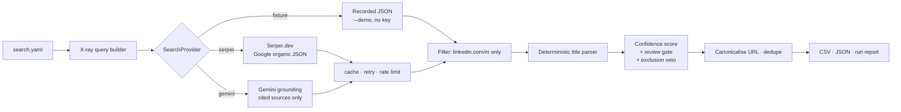

# grounded-prospector

[](https://github.com/ShamanIsBack/grounded-prospector/actions/workflows/ci.yml)
[](https://www.python.org/downloads/)
[](https://mypy-lang.org/)
[](https://github.com/astral-sh/ruff)
[](LICENSE)

Find B2B decision-makers from public search results — **without scraping, and with every row
traceable to the result it came from.**

Give it companies to staff-map, or job-title phrases to find people by. It builds Google X-ray
queries, runs them through a search API, and returns a scored, deduplicated CSV of LinkedIn
profiles, each carrying the raw title, snippet and query it was derived from.

```console
$ grounded-prospector run --demo
                                        Top 10 prospects
┌─────────────────────────────┬────────────────────────────────────┬───────────────────┬──────┬────────┐
│ Name                        │ Headline                           │ Target            │ Conf │ Review │
├─────────────────────────────┼────────────────────────────────────┼───────────────────┼──────┼────────┤
│ Ahmed bin Rashid Al Maktoum │ Head of Incentive Travel           │ Dune & Palm Ev…   │ 1.00 │   no   │
│ Layla Haddad                │ MICE Manager                       │ Dune & Palm Ev…   │ 1.00 │   no   │
│ Priya Nair                  │ Events Director                    │ Dune & Palm Ev…   │ 1.00 │   no   │
│ Tomasz Wierzbicki           │ Senior Incentive Producer          │ Dune & Palm Ev…   │ 1.00 │   no   │
│ Marco Ferretti              │ Director of Outbound Travel        │ Falcon Bay Travel │ 1.00 │   no   │
│ Yusuf Demir                 │ Lifestyle & Concierge Director     │ Majlis Concierge  │ 1.00 │   no   │
│ Layla Haddad                │ Luxury Concierge & Villa Specialist│ luxury concierge  │ 1.00 │   no   │
│ Tom Bexley                  │ Recruiter hiring a Luxury Concierge│ luxury concierge  │ 1.00 │  yes   │
│ Nadia Fahim                 │ Guest Relations Manager            │ luxury concierge  │ 0.80 │  yes   │
│ Sara Okonkwo                │ MICE Consultant                    │ Falcon Bay Travel │ 0.60 │  yes   │
└─────────────────────────────┴────────────────────────────────────┴───────────────────┴──────┴────────┘
```

The last four rows show the scoring doing its job: a genuine self-described concierge passes; a
**recruiter** advertising the role is vetoed despite a perfect score; someone the phrase matches
only in the snippet is flagged; a consultant with no company match in the title is flagged too.

## Quickstart — no API key needed

```bash
git clone https://github.com/ShamanIsBack/grounded-prospector
cd grounded-prospector
python -m venv .venv && .venv/Scripts/activate   # or source .venv/bin/activate
pip install -e ".[dev]"

grounded-prospector run --demo
```

`--demo` replays bundled fixtures, so the full pipeline — pagination, deduplication, scoring,
the review gate, CSV export — runs offline with **no credentials at all**. That is a deliberate
acceptance test, not a convenience: if the demo ever needs a key, the project has failed.

### Running it for real

```bash
cp .env.example .env          # paste a key from https://serper.dev (2,500 free, no card)
cp search.example.yaml search.yaml

grounded-prospector run --dry-run     # see every query and the cost, send nothing
grounded-prospector run               # write out/prospects.csv
```

## How it works



Each target becomes one query:

```
site:linkedin.com/in/ "Dune & Palm Events" "Dubai" ("MICE" OR "Director" OR …)
    -"recruiter" -intitle:"profiles" -inurl:"dir/"
```

## Where the data comes from

Every field about a person is parsed from what the search engine returned, by plain string
rules — so any row can be audited without trusting the tool:

- **Names come from search-result titles.** Public LinkedIn titles follow
  `First Last - Headline - Company | LinkedIn`. `extract.py` parses that with plain string
  rules — pure, synchronous, and unit-tested, including Gulf name particles
  (`Ahmed bin Rashid Al Maktoum`) and en/em-dash separators.
- **Every row carries its evidence.** `Raw title`, `Snippet`, `Source query` and `LinkedIn URL`
  all ship in the CSV, so any row can be checked by opening one link.
- **A missing target match is a hard gate.** If the target does not appear in the result title,
  the row is flagged no matter how good the other signals are. Someone whose profile merely
  mentions your target is not a lower-confidence version of the right person — they are the
  wrong person.

The default backend has no language model anywhere in it: Serper returns Google's organic
results as JSON and the parser reads them directly. The optional `gemini` backend does use one,
under a rule described in [Backends](#backends).

### Confidence scoring

| Signal | Weight |
|---|---|
| Target appears **in the result title** | 0.40 |
| Target appears **only in the snippet** | 0.20 |
| A target role keyword appears in the headline or snippet | 0.25 |
| Title split cleanly into both a name and a headline | 0.20 |
| Parsed name looks like a person's name | 0.15 |

Below `0.60`, without a match **in the title**, or when an `exclude` term matches, the row gets
`Needs review = yes` plus a plain-English list of what was missing.

The title/snippet distinction is not pedantry: a result title names the *current* employer,
while a snippet is free text that also holds past roles. Measured on a real 433-prospect run,
grading that signal cut "ready to contact" from 246 rows to 96 — see
[`DESIGN_NOTES.md`](DESIGN_NOTES.md) and [ADR-004](docs/DECISIONS.md).

**Location is deliberately absent from scoring** — matching on it is exactly how a search for
people *in* Austin returns people *named* Austin. It is exported as a hint column only.

## Configuration

Two files, split by one rule: **`search.yaml` is what you look for, `.env` is how the tool
runs.** Retargeting never means hunting through environment variables.

### `search.yaml` — the search brief

Everything defining a search lives here, so a whole campaign is one file you can copy, diff and
keep alongside others.

| Field | Default | Purpose |
|---|---|---|
| `location` | *required* | Geographic anchor, quoted into every query |
| `country` / `language` | `ae` / `en` | Serper `gl` / `hl` — biases which results come back |
| `roles` | `[]` | Seniority/function keywords, OR-ed into one group |
| `keywords` | `[]` | Optional second OR-group, AND-ed with `roles` |
| `targets` | *required* | What to search for — see below. `agencies` is still accepted |
| `exclude` | `[]` | Terms that disqualify a result, applied to every target |
| `max_pages` | `3` | Result pages per target |
| `min_confidence` | `0.0` | Drop rows scoring below this before writing the CSV |

Each target has a `name`, an optional free-text `segment`, its own optional `exclude` list, and
a `kind` that decides **how a match is read**:

| `kind` | `name` is | A match in the result title means |
|---|---|---|
| `company` (default) | an employer | "works here now" — a LinkedIn title states the current employer |
| `phrase` | a self-description | "this is how they present themselves" |

`phrase` targets turn the tool from *staff-mapping known companies* into *finding a category*,
which is the only thing that works when a market is a long tail of sole traders. They need the
**local** wording: `country` biases ranking but does not restrict language, so the English
`"wedding planner"` with `country: pl` returns American planners while the Polish
`"wedding plannerka"` returns Polish ones. The tool warns about exactly this when it loads a
brief.

```yaml
exclude: []                       # optional, applies to every target

targets:
  - name: Wytwórnia Ślubów        # kind: company is the default
    segment: agencja
  - name: mistrz ceremonii
    kind: phrase
    segment: kategoria
    exclude: [pogrzeb]            # otherwise funeral celebrants match perfectly
```

Exclusions match as a substring of the normalised text — `pogrzeb` also catches the inflected
`pogrzebowej` — so prefer a distinctive stem over a short one.

**Retargeting is a single-file edit.** Dubai travel → Warsaw fintech:

```yaml
location: Warsaw
country: pl                        # was ae — otherwise results stay Emirati
language: pl
roles: [CTO, Head of Engineering, VP Engineering]
keywords: [fintech, payments]      # narrows without diluting the role list
targets:
  - name: Booksy
    segment: saas
```

```bash
grounded-prospector run --search warsaw.yaml --dry-run   # check the queries, spend nothing
```

`--pages` and `--min-confidence` override the brief for a single run; the brief overrides the
built-in defaults. Nothing about the search subject lives in `.env`.

### `.env` — credentials and infrastructure

Keys are read from the environment and are **never** CLI options — arguments leak into shell
history, process listings and CI logs.

| Variable | Default | Purpose |
|---|---|---|
| `SERPER_API_KEY` | – | Serper.dev key |
| `GEMINI_API_KEY` | – | Gemini key, for `--provider gemini` |
| `GP_MAX_QUERIES` | `50` | Hard ceiling per run; an account-level guard, not part of a search |
| `GP_RESULTS_PER_PAGE` | *unset* | Serper page size. **Leave unset on a free plan** — see below |
| `GP_CONCURRENCY` | `3` | Simultaneous in-flight searches |
| `GP_RATE_LIMIT_PER_MINUTE` | `30` | Token-bucket pacing |
| `GP_CACHE_TTL_HOURS` | `168` | Response cache lifetime |

Responses are cached in SQLite keyed by provider, page size, country, language, query and page
number, so re-running a refined search costs nothing for the parts that did not change.

> **Free Serper plans and `num`.** Serper rejects `num` above 10 when the query uses search
> operators — which every X-ray query does — with
> `400 Query pattern not allowed for free accounts`. So `num` is not sent by default and Google
> picks the page size (~10 results). `page` is unaffected, so use `--pages` to fetch more. On a
> paid plan, set `GP_RESULTS_PER_PAGE=100` to get the same results in fewer billed queries.

## Output

`out/prospects.csv` (UTF-8 with BOM, so Excel renders non-ASCII names correctly), alongside
`prospects.json` and `run_report.json`.

> **[`INSTRUCTIONS.md`](INSTRUCTIONS.md)** is the operator's runbook: how to probe a new target
> list before spending, which rows to trust and in what order, what each review reason means,
> and how to refine results for free against the cache.

Evidence columns are filled by the tool: name, headline, company from title, **target**,
**match type**, segment, LinkedIn URL, location hint, confidence, needs-review flag and reasons,
SERP position, snippet, raw title, source query, provider, timestamp.

**The CRM columns — Email, Phone, Business profile, Client segment, Potential rating, Notes —
are deliberately left blank.** This tool finds people; it does not find contact details.
Filling them with guesses would invite someone to email an unverified address.

## Backends

| | **serper** (default) | **gemini** | **fixture** |
|---|---|---|---|
| Source | Google organic results as JSON | Grounding with Google Search | Recorded responses |
| Pagination | ✅ `page` (plus `num` on paid plans) | ❌ none available | ✅ replayed pages |
| Snippets | ✅ | ❌ | ✅ |
| Deterministic | ✅ | ❌ model rewrites the query | ✅ |
| Latency | ~200–500 ms | ~2–4 s | instant |
| Cost | 2,500 free, then ~$1/1k | 5,000 free/mo, then ~$14/1k | free |
| Key | `SERPER_API_KEY` | `GEMINI_API_KEY` | none |

```bash
grounded-prospector providers      # print this table live
```

Gemini grounding was the original design and was demoted to secondary after measurement, not
taste — it exposes no raw result list, so it cannot walk a result set. It is kept as a real
second implementation because a provider abstraction with one backend proves nothing. The
reasoning is in [`DESIGN_NOTES.md`](DESIGN_NOTES.md) and [ADR-006](docs/DECISIONS.md).

**The rule for the `gemini` backend:** the model is a search dispatcher, never a source of
facts. Only `url_citation` annotations — a URL and the page's own title — become data. Its prose
goes to an `llm_notes` field that nothing reads, and the same parser handles the result as on
any other backend. This is what makes the guarantees above hold on a backend that does contain a
language model ([ADR-003](docs/DECISIONS.md)).

## Compliance

- **No scraping.** No LinkedIn page is ever fetched. The tool reads a search index through the
  vendor's own API, which is what those APIs are for.
- **No Terms-of-Service violation.** An earlier iteration drove a real browser against Google
  search results. That works, and it breaks Google's ToS (`robots.txt: Disallow: /search`). It
  was deleted rather than shipped.
- **Public data only**, and only what a search engine already publishes in its results.
- **GDPR.** Names and job titles are personal data. An EU-based operator processing them for
  B2B outreach relies on *legitimate interest* (Art. 6(1)(f)), which carries obligations: a
  balancing test, disclosure of the source in first contact, and honouring objections. This
  tool produces a research list, not consent.

## Limitations

Stated plainly, because a prospecting tool that oversells itself wastes someone's week. Numbers
are from real runs across three markets.

- **Recall is not exhaustive.** You get what the search index surfaces, not an org chart.
  Coverage is wildly uneven between companies: one run returned 48 prospects for one agency and
  1 for another. A thin result usually means a small LinkedIn footprint, not a failed search.
- **About 22% of company-mode rows are ready to contact** (96 of 433); the rest carry a review
  reason. That ratio is honest scoring, not a defect.
- **Phrase mode is far noisier, inherently.** Most people who mention a phrase are not that
  thing: one run yielded roughly 45 usable rows from 304. Where a real target list exists, use
  `company` mode.
- **An exclusion veto does not lower the score.** The score describes the evidence; the flag
  describes our judgement of it. So `min_confidence` will not filter out a vetoed row — filter
  on `Needs review`, not on confidence alone.
- **Token matching accepts supersets.** "Al Noor Majlis Concierge, LLC" contains every token
  of "Majlis Concierge", so its staff pass the gate for that target.
- **Dropping `location` widens geography.** Global brands then return staff from any office —
  a real run surfaced Ivory Key Club USA and Silk Lantern Journeys India alongside the Dubai teams.
- **Long names get truncated past the gate.** Google clips long titles with an ellipsis, so a
  company with a long name can score zero title-verified while its staff are really there.
- **Job titles go stale.** A snippet reflects whenever the page was last indexed.
- **The same person can hold two LinkedIn profiles.** Deduplication is by profile URL, which
  cannot merge genuinely distinct URLs.
- **Names must be right.** `FalconBayTravel` returned nothing under any query shape; `Falcon Bay Travel`
  returned a full page. Check a thin result before blaming the index.

## Development

```bash
ruff check . && ruff format --check .
mypy --strict src
pytest --cov
```

310 tests, 98% coverage, `mypy --strict` clean. The suite runs entirely offline — there is no
network in CI and no key required to contribute. Provider tests build their response payloads
inline, so each test states the API shape it depends on next to the assertion about it.

The `--demo` fixtures contain **fabricated** people and companies. Shipping a real recording
would publish real individuals' personal data to no purpose, so a test asserts that only the
known-fictional profile slugs ever appear in them. `scripts/record_fixture.py` will record a
real Gemini response for anyone working on the grounding parser; its output is gitignored for
the same reason.

## Further reading

| File | What it is for |
|---|---|
| [`INSTRUCTIONS.md`](INSTRUCTIONS.md) | Operator's runbook — probing, triage, retargeting |
| [`DESIGN_NOTES.md`](DESIGN_NOTES.md) | How the design got here, and what each wrong turn cost |
| [`docs/DECISIONS.md`](docs/DECISIONS.md) | Nine ADRs — the formal record, one per decision |

Built for a Polish agritourism property seeking B2B partners abroad. It went through three
abandoned approaches before this one; all three are written up rather than quietly deleted.

## License

MIT — see [LICENSE](LICENSE).
