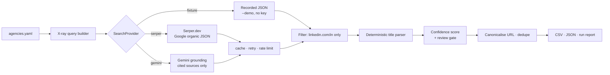

# grounded-prospector

[](https://github.com/ShamanIsBack/grounded-prospector/actions/workflows/ci.yml)
[](https://www.python.org/downloads/)
[](https://mypy-lang.org/)
[](https://github.com/astral-sh/ruff)
[](LICENSE)

Find B2B decision-makers at a list of target companies, from public search results —
**without scraping anything, and without letting a language model invent people.**

Give it a list of companies and the roles you care about. It builds Google X-ray queries,
runs them through a search API, and returns a scored, deduplicated CSV of LinkedIn profiles
with every claim traceable to the search result it came from.

```console
$ grounded-prospector run --demo
                                Top 8 prospects
┏━━━━━━━━━━━━━━━━━━━━━━━━━━━━━┳━━━━━━━━━━━━━━━━━━━━━━━━━━┳━━━━━━━━━━━━━━━━━━━┳━━━━━━┳━━━━━━━━┓
┃ Name                        ┃ Headline                 ┃ Agency            ┃ Conf ┃ Review ┃
┡━━━━━━━━━━━━━━━━━━━━━━━━━━━━━╇━━━━━━━━━━━━━━━━━━━━━━━━━━╇━━━━━━━━━━━━━━━━━━━╇━━━━━━╇━━━━━━━━┩
│ Ahmed bin Rashid Al Maktoum │ Head of Incentive Travel │ Dune & Palm Ev... │ 1.00 │   no   │
│ Layla Haddad                │ MICE Manager             │ Dune & Palm Ev... │ 1.00 │   no   │
│ Marco Ferretti              │ Director of Outbound…    │ Falcon Bay Trav…  │ 1.00 │   no   │
│ Sara Okonkwo                │ MICE Consultant          │ Falcon Bay Trav…  │ 0.60 │  yes   │
│ Elena Rossi                 │ -                        │ Majlis Concierge  │ 0.15 │  yes   │
└─────────────────────────────┴──────────────────────────┴───────────────────┴──────┴────────┘
```

## Quickstart — no API key needed

```bash
git clone https://github.com/ShamanIsBack/grounded-prospector
cd grounded-prospector
python -m venv .venv && .venv/Scripts/activate   # or source .venv/bin/activate
pip install -e ".[dev]"

grounded-prospector run --demo
```

`--demo` replays bundled fixtures, so the full pipeline — pagination, deduplication,
scoring, the review gate, CSV export — runs offline with **no credentials at all**. That
is a deliberate acceptance test, not a convenience: if the demo ever needs a key, the
project has failed.

### Running it for real

```bash
cp .env.example .env          # paste a key from https://serper.dev (2,500 free, no card)
cp agencies.example.yaml agencies.yaml

grounded-prospector run --dry-run     # see every query and the cost, send nothing
grounded-prospector run               # write out/prospects.csv
```

## How it works



The query for each company looks like this:

```
site:linkedin.com/in/ "Dune & Palm Events" "Dubai" ("MICE" OR "Director" OR …)
    -intitle:"profiles" -inurl:"dir/"
```

## Why it cannot invent people

The obvious way to build this is to ask an LLM "who works at X?" and parse its answer.
That produces confident, well-formatted, **fictional** people — and in B2B outreach a
fabricated name is worse than no result, because it gets emailed.

This tool never does that. It is structural, not a matter of prompt wording:

- **Names come from search-result titles, not from prose.** Public LinkedIn titles follow
  `First Last - Headline - Company | LinkedIn`. `extract.py` parses that with plain string
  rules — pure, synchronous, and covered by unit tests including Gulf name particles
  (`Ahmed bin Rashid Al Maktoum`) and en/em-dash separators.
- **No model output reaches the parser.** With the Gemini backend, only `url_citation`
  annotations become data. The model's prose is stored in a separate `llm_notes` field and
  never read for facts.
- **Every row carries its evidence.** `Raw title`, `Snippet`, `Source query` and
  `LinkedIn URL` all ship in the CSV, so any row can be checked by opening one link.
- **A company mismatch is a hard gate.** If the target company does not appear in the
  result, the row is flagged for review no matter how good the other signals are. Someone
  whose headline merely mentions your target is not a lower-confidence version of the right
  person — they are the wrong person.

### Confidence scoring

| Signal | Weight |
|---|---|
| Target company appears in the title or snippet | 0.40 |
| A target role keyword appears in the headline or snippet | 0.25 |
| Title split cleanly into both a name and a headline | 0.20 |
| Parsed name looks like a person's name | 0.15 |

Below `0.60`, or on any company mismatch, the row gets `Needs review = yes` plus a
plain-English list of what was missing. **Location is deliberately absent from scoring** —
matching on it is exactly how a search for people *in* Austin returns people *named* Austin.
It is exported as a hint column only.

## Backends

| | **serper** (default) | **gemini** | **fixture** |
|---|---|---|---|
| Source | Google organic results as JSON | Grounding with Google Search | Recorded responses |
| Pagination | ✅ `num` + `page` | ❌ none available | ✅ replayed pages |
| Snippets | ✅ | ❌ | ✅ |
| Deterministic | ✅ | ❌ model rewrites the query | ✅ |
| Latency | ~200–500 ms | ~2–4 s | instant |
| Cost | 2,500 free, then ~$1/1k | 5,000 free/mo, then ~$14/1k | free |
| Key | `SERPER_API_KEY` | `GEMINI_API_KEY` | none |

```bash
grounded-prospector providers      # print this table live
```

Gemini grounding was the original design and was demoted after measurement, not taste. It
exposes no raw result list — only the handful of sources the model chose to cite, with no
page or offset parameter — so it cannot walk a result set. It is kept as a real second
implementation because a provider abstraction with one backend proves nothing. The full
reasoning is in [`docs/DECISIONS.md`](docs/DECISIONS.md) (ADR-006).

## Output

`out/prospects.csv` (UTF-8 with BOM, so Excel renders non-ASCII names correctly), alongside
`prospects.json` and `run_report.json`.

Evidence columns are filled by the tool: name, headline, company from title, target agency,
segment, LinkedIn URL, location hint, confidence, needs-review flag and reasons, SERP
position, snippet, raw title, source query, provider, timestamp.

**The CRM columns — Email, Phone, Business profile, Client segment, Potential rating,
Notes — are deliberately left blank.** This tool finds people; it does not find contact
details. Filling them with guesses would invite someone to email an unverified address.

## Configuration

Keys are read from the environment or `.env` and are **never** CLI options — arguments leak
into shell history, process listings and CI logs.

| Variable | Default | Purpose |
|---|---|---|
| `SERPER_API_KEY` | – | Serper.dev key |
| `GEMINI_API_KEY` | – | Gemini key, for `--provider gemini` |
| `GP_MAX_QUERIES` | `50` | Hard ceiling; the run aborts rather than overspending |
| `GP_MAX_PAGES` | `3` | Result pages per company |
| `GP_RESULTS_PER_PAGE` | `100` | Serper page size (max 100) |
| `GP_CONCURRENCY` | `3` | Simultaneous in-flight searches |
| `GP_RATE_LIMIT_PER_MINUTE` | `30` | Token-bucket pacing |
| `GP_CACHE_TTL_HOURS` | `168` | Response cache lifetime |
| `GP_COUNTRY` / `GP_LANGUAGE` | `ae` / `en` | Serper `gl` / `hl` |

Responses are cached in SQLite keyed by provider, page size, country, query and page
number, so re-running a refined search costs nothing for the parts that did not change.

## Compliance

- **No scraping.** No LinkedIn page is ever fetched. The tool reads a search index through
  the vendor's own API, which is what those APIs are for.
- **No Terms-of-Service violation.** An earlier iteration of this project drove a real
  browser against Google search results. That works, and it breaks Google's ToS
  (`robots.txt: Disallow: /search`). It was deleted rather than shipped — see ADR-001.
- **Public data only**, and only what a search engine already publishes in its results.
- **GDPR.** Names and job titles are personal data. An EU-based operator processing them
  for B2B outreach relies on *legitimate interest* (Art. 6(1)(f)), which carries obligations:
  a balancing test, disclosure of the source in first contact, and honouring objections.
  This tool produces a research list, not consent.

## Limitations

Stated plainly, because a prospecting tool that oversells itself wastes someone's week:

- **Recall is not exhaustive.** You get what the search index surfaces for your query, not
  a company's org chart.
- **Job titles go stale.** A search snippet reflects whenever the page was last indexed.
- **Homonyms and name-collisions happen.** A search anchored on a place name returns people
  named after that place. This is what the review gate exists for.
- **Roughly 20% of rows need a human look** on real data. That is a feature of honest
  scoring, not a defect — the flagged rows are the ones worth checking.

## Development

```bash
ruff check . && ruff format --check .
mypy --strict src
pytest --cov
```

255 tests, 97% coverage, `mypy --strict` clean. The suite runs entirely offline against
recorded fixtures — there is no network in CI and no key required to contribute.

The demo fixtures contain **fabricated** people and companies. Shipping a real recording
would publish real individuals' personal data to no purpose, so a test asserts that only
the known-fictional profile slugs ever appear in them.

## Project background

Built for a Polish agritourism property seeking B2B partners abroad. It
went through three abandoned approaches
before this one — DuckDuckGo scraping (hard-blocked), Google scraping (works, violates
ToS), and the Google Custom Search API (closed to new customers, retiring January 2027).
Each is written up in [`docs/DECISIONS.md`](docs/DECISIONS.md).

## License

MIT — see [LICENSE](LICENSE).
